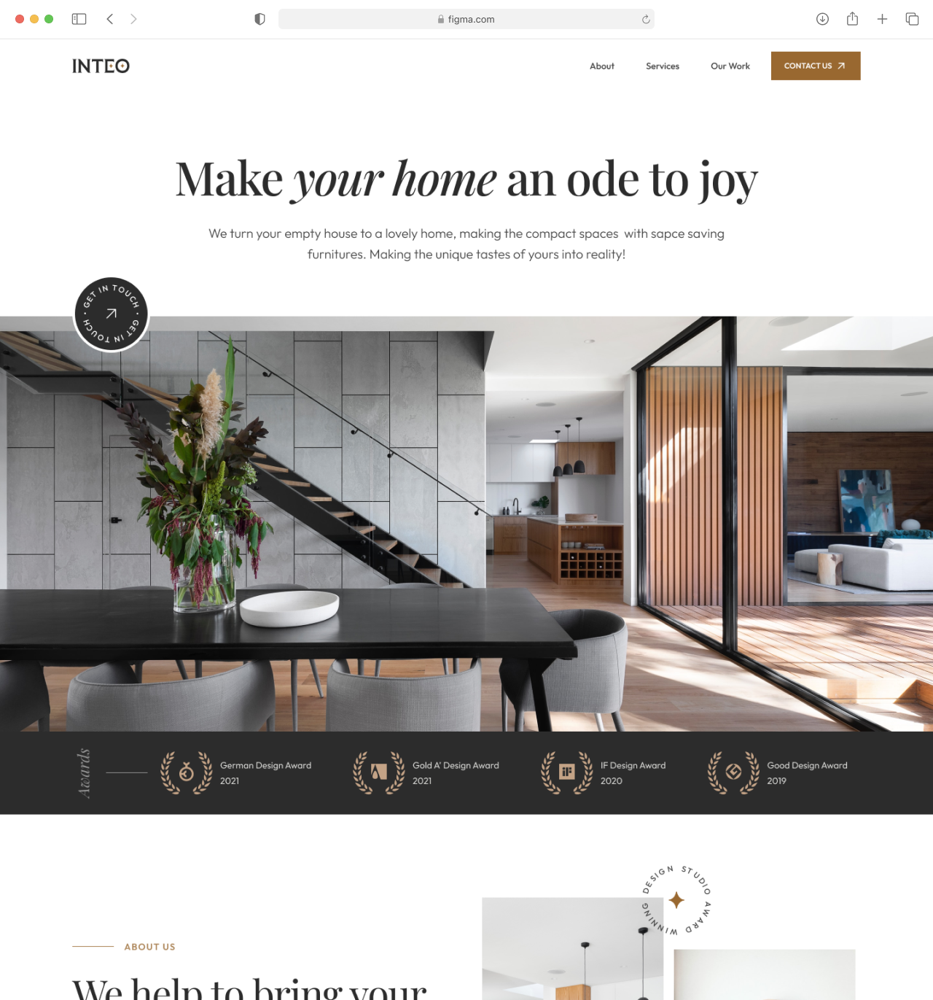

# Frontend Home Test

### Project brief

As part of our application process,we invite you to demonstrate your skills through a brief assignment. Convert the following designs to HTML/CSS/JS, any extra polish or features you might want to put in will not go unnoticed.

### Design

Design is available in Figma file ([Click to preview](https://www.figma.com/file/hd51QenOPBVNTVGubbbuMo/frontend-home-test?type=design&node-id=0%3A1&mode=design&t=CGkQlu3h0SwNyhbk-1)). If you haven't already, sign up for a free Figma account, so you can work with the design.

- The images used in the design have already been added to the projects, under `public/img` folder.
- The SVG icons used in the design are in the `public/icons` folder.
- The font used in the design are `Playfair Display` and `Inter`. You can get the font from Google Fonts.

### Requirements

- Use HTML5 / CSS / JavaScript
- Compatible with latest versions of Chrome
- Make sure the colos, spacing and sizing are as close as possible to the design

### Bonus points

- [ ] Use tailwindcss for styling
- [ ] Use Vue/Nuxt for the project
- [ ] Animate the design elements as you see fit
- [ ] Make the design responsive

### Deadline

Take your time but we would like to see the results within 10 days. If you need more time, please let us know.

### How to submit

When you're done, create a private repo on GitHub that just contains your project and invite `adarsh4d` as a collaborator.

Once we've had a chance to review your submission we'll get back to you with next steps.

If you have any questions, please ask!

Thank you and good luck! :thumbsup:
